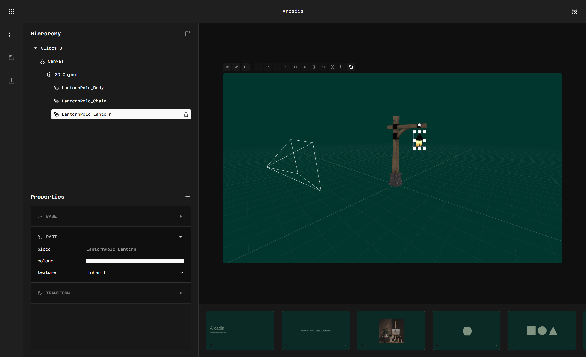

<div align="center">
  
  <h3>Quartz</h3>
  <p>Open core slides engine; built for ambitious presentations.</p>
  <div>
    
    
  </div>
</div>

<br />

Quartz is a fast and modern slides editor for presentations that move, with features such as: timelines, states, node sync, live presenting in Discord, and real 3D scenes.




## Current Features

- **Keyboard-first editor**: built to be driven from the keyboard
- **Animation**: states, a timeline with easing, and click or hover events
- **Linked nodes**: edit once, update on every slide
- **Present in Discord**: everyone in the voice channel follows your slides live
- **Media**: images, GIFs and video
- **3D scenes** (Pro): models, cameras and shaders inside your slides

## Open core

The app is licensed with Apache-2.0, but the 3D module is not inside this repository. Quartz runs fully without it; 3D nodes simply don't render.

## Run it locally

You need [Bun](https://bun.sh) and a [Supabase](https://supabase.com) project.

```bash
cp .env.example .env   # fill in your Supabase values
cd web
bun install
bun run db:push        # create the tables
bun run dev
```

> Self-hosting isn't complete yet: the database trigger that creates each slide's root node isn't in this repo, expect bugs.

Built with Nuxt 4, Vue 3, Supabase, Drizzle and UnoCSS.

## Contributing

Contributions are welcome. Please read the [Code of Conduct](CODE_OF_CONDUCT.md) and [Contributing](CONTRIBUTING.md) guide first.
